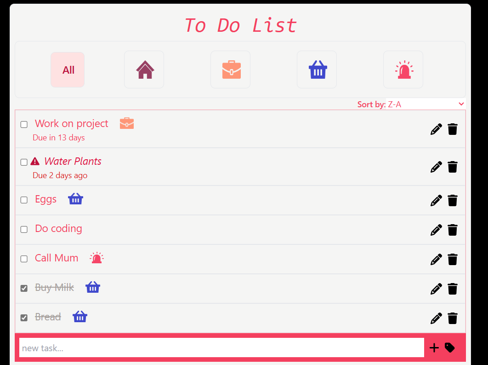
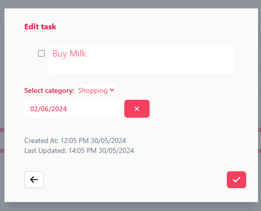
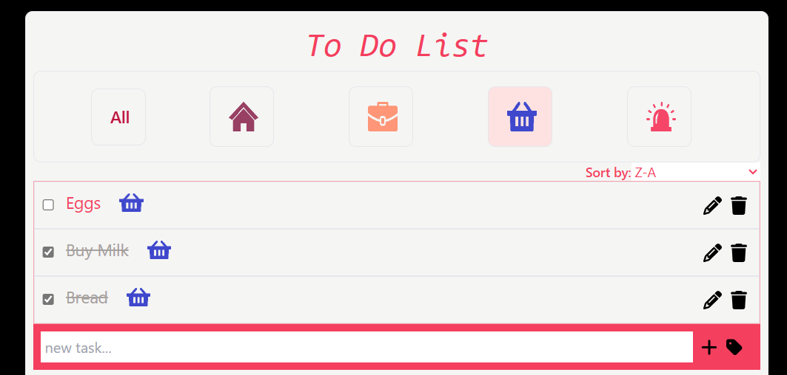
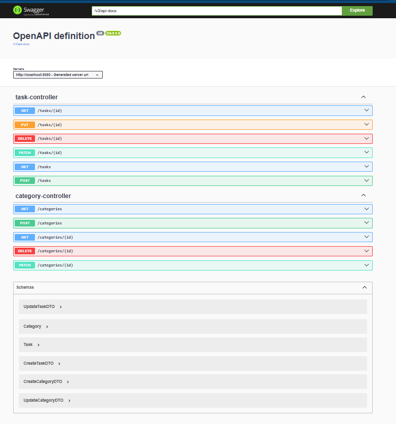

# To-Do App

## Demo & Snippets

### Main Page With Sorted, Completed and Overdue Tasks



### Add/Edit Task Form



### Category Filtered Tasks



### Swagger API Doc



## Requirements / Purpose

### Purpose

The purpose of the project is to create a to-do list app having backend with Spring that can create, update, read and delete todos from a MySQL database and to set-up a frontend application with React that interacts with this backend.

### Frontend MVP

- Ability to add, complete, delete and edit todos
- Typescript & testing with React Test Library
- All errors must be handled and passed on properly back to the user (toast notifications are a good way of doing this)
- Must look polished

### Backend MVP

- All endpoints must be error handled such that they return the correct status codes and messages.
- Implement a logging strategy for requests being processed
- Use spring swagger to generate documentation for your API

### Stack Used

- JAVA Spring (back-end)
- Typescript (front-end)
- MySQL (Database)

## Build Steps

1. Clone the repo

` git clone https://github.com/Ammara-Haroon/todo.git`

2. Go to the repo folder and install dependencies

` npm install`

3. Create a database in MySQL to hold app data
4. Add _resources_ folder to src\main and create a file _applicaton.properties_ with the following content (replace credentials and check localhost and port number for MySQL)

```spring.application.name=todo
spring.datasource.url=jdbc:mysql://localhost:3306/NAME_OF_DATABASE_FROM_PREVIOUS_STEP
spring.datasource.username=root (OR USER_NAME)
spring.datasource.password=YOUR_PASSWORD
spring.jpa.hibernate.ddl-auto=update
logging.pattern.console=%date{ISO8601} %-5level %class{0}:%L -[%M] %msg%n
logging.file.name=application.log
```

5. To run backend run the spring boot app. Server runs on port 8080 by default.
6. Go to directory _todo-front-end_ and install dependencies

` npm install`

7. Create an .env file in the directory _todo-front-end_ with the following contents.

`VITE_APP_BACKEND_BASE_URL=http://localhost:8080`

8. To run the front-end use:

` npm run dev`

- The app runs on localhost:5173 by default. If it rus on different port, CORS permissions need to be reset in src\main\java\com\projects\todo\config\WebConfig.java.
- Swagger API documentation is available at http://localhost:8080/swagger-ui/index.html
- Application backend logs are saved in application.log files.

## Design Goals / Approach

- Used form submission to update the task list on the page. This was done differently in the beginning when a task was just a description and no forms were involved in adding and updating the task. After categories and due date fields were introduced, update and add have to be moved to a separate form to get additional values from the user.
- The simpler interface is still kept for ease of use.
- Delete works by updating the state and updating data on server side
- Task can have null values as due date and category. This was done to be able to work with tasks that have no category or due date. When editing the completion status a PATCH request is sent to the server but when the task gets updated through the form a PUT request is made. The server makes sure that a null value for a field in PATCH request ignores that field in update whereas a null value is PUT is considered as user changing the due date or category to null or in other ways removing sue date or category from the task.
- Context is used to share name of categories across components.
- Tasks are by default sorted by their completion status and a secondary sort is added as selected by the user.
- ModelMapper mappings and TaskService ensure that category for a task is valid.
- JPA Repository methods were used to perform sorting and filetring

## Features

- Adds a new task without any extra details from the homepage
- Adds a new task with due date and category from a form like interface
- Deletes a task
- Edits a task (can change category, completed status and due date)
- Any task name entry from the homepage carries on to the form
- Tabs for different categories at the top to filter tasks based on categories
- Ability to mark the task as complete or incomplete
- Sorts tasks based on last updated, date of creation, alphabetic order and due date
- API points to edit, delete, update tasks and categories with proper error handling messages and server status codes.
- Used log4sj to log activity and errors in a log file
- Used swagger to get documentation for API end points.

## Known issues

- Adding a new task resets the sort that might not be the intention of the user
- Marking a task as complete does not automatically make the tasks sort into complete and incomplete groups

## Future Goals

- Adding a search filter for tasks

## Change logs

### 22/05/2024 - Created basic todo app

- Created backend end points to update, delete and edit tasks and added error handling
- Added a simple form to add and edit task at the front end

### 24/05/2024 - Created entity category

- Created backend end points to update, delete and edit category and added error handling
- Updated task endpoints to cater for category and added error handling for trying to associate an invalid category with the task

### 28/05/2024 - Added sorting and filtering

- Changed queries to handle sorting and filtering at the backend
- Added components at the front-end to facilitate sorting and filtering

### 29/05/2024 - sorting and filtering

- Changed ModelMapper, DTO and entity to debug issues in delete and updating to a null due date or category

### 29/05/2024 - error handling and loading

- Added a loading spinner and error message component to front end

### 30/05/2024 - Added background color to selected tab

### 31/05/2024 - Added responsiveness for smaller screens

### 04/06/2024 - Added unit tests

## Struggles

- I needed to tweak ModelMapper to ensure that UpdateTaskDTO does not add a category that is invalid.
- Since tasks could have null categories and null due date I had to tweak mappings to keep that information intact.
- The cascading had to turn off to make sure deleting tasks do not delete categories
